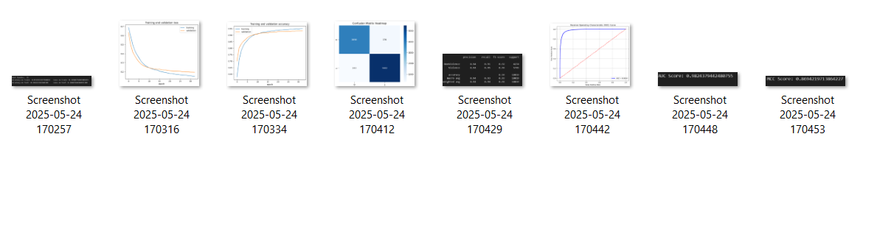

In the above folder 'result of model Ss', we have pasted screenshots of the hockey fight dataset and Real Life violence Situations Dataset.

 Result Metric consists of confusion Matrix, Training and validation loss and accuracy, ROC AUC curve, MCC score, and AUC score.
 
